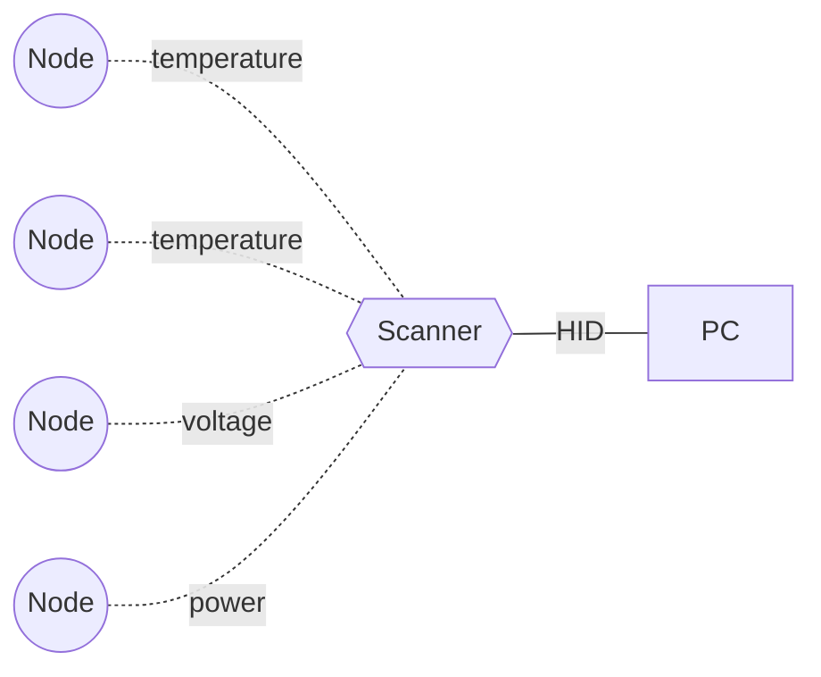

# DAS
Layout of A Low-power **D**istributed **A**cquisition **S**ystem  
低功耗分布式采集系统Layout仓库

## System Architecture
Node collects data through various sensors and then broadcasts the collected data through BLE.  
Scanner acquires data from each node by scanning the BLE broadcast.  
In the same scenario, multiple Scanners can acquire all the data, and increasing the number of Scanners will not increase the bandwidth consumption.  
For low-frequency data acquisition, each Node will only consume a very small amount of bandwidth, which allows a very large number of Nodes to acquire data at the same time.  
If there is a special need, the Nodes can form a network to realize a large area coverage.  

节点通过各种传感器采集数据，然后通过 BLE 广播采集到的数据。  
Scanner 通过扫描 BLE 广播获取各个节点的数据。  
同一个场景下，多个 Scanner 都可以获取到所有的数据，并且增加 Scanner 的数量不会增加带宽消耗。  
对于低频采集的数据，每个 Node 只会消耗非常小的带宽，这样可以允许非常多的 Node 同时进行数据采集。  
如果有特殊需要，可以让 Node 组成网络实现大面积的覆盖。  
